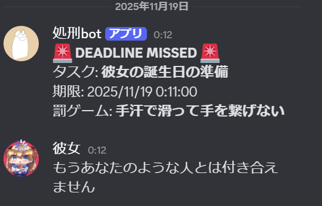
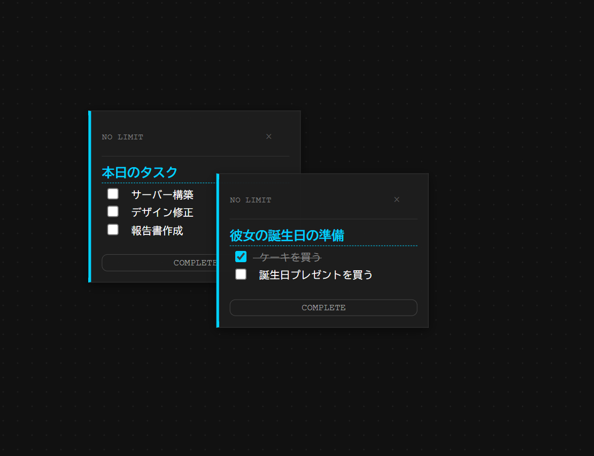
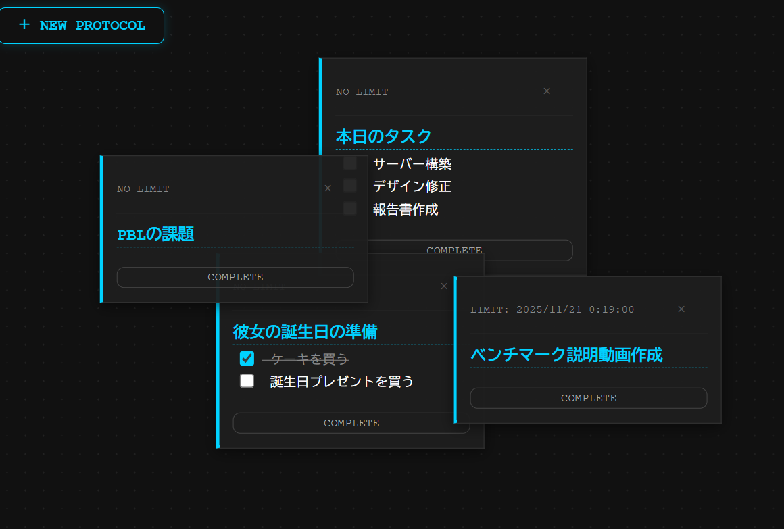

# Infinite Sticky MD (Hostage Edition)
### 〜退路を断つ、完全拘束型タスク管理アプリケーション〜


## 📖 概要 (Concept)
「PCを閉じても逃げられない」をコンセプトにした、**背水の陣**を敷くためのタスク管理アプリです。

従来のToDoアプリにある「優しいリマインダー」では、私はどうしてもタスクを後回しにしてしまう癖がありました。そこで、「期限を過ぎたら強制的に社会的制裁（Discordでの晒し）が執行される」という**リスク駆動型**の管理システムを開発しました。

フロントエンドだけでなくバックエンドで独立した監視システムが稼働しているため、ブラウザを閉じても、PCをシャットダウンしても、サーバーが動いている限り期限からは逃げられません。

## ✨ 機能 (Features)

### 1. 無限キャンバスとMarkdownメモ
- **ドラッグ＆ドロップ:** 思考の整理を妨げないよう、付箋を自由な位置に配置可能。
- **Markdown記法対応:** 箇条書き、太字、コードブロックなど、エンジニアライクな記録が可能。
- **インタラクティブなチェックボックス:** Markdownビューワーでありながら、チェックボックスを直接クリックして完了状態を保存できます。

### 2. 処刑システム (The Execution System)
- **24時間監視:** バックエンドのCron Jobが1分ごとに全タスクをスキャン。
- **強制通知:** 期限を1秒でも過ぎた未完了タスクは、即座にDiscordのWebhookを通じて指定チャンネルへ「晒しメッセージ」を送信します。
- **退路なし:** クライアントアプリを閉じていても、サーバー側で判定を行うため回避不能です。

### 3. サイバーパンクUI
- 緊張感を高めるダークモードとネオングリッドのデザインを採用。



## 💡 工夫した点・技術的挑戦 (Technical Highlights)

### 個人の「怠惰」に対するハック (着想の経緯)
一般的なタスク管理ツールは「管理すること」に主眼が置かれていますが、私にとって最大の問題は「着手しないこと」でした。
「人は利得よりも損失を回避する傾向がある（プロスペクト理論）」に基づき、タスク未達成に明確な「痛み（恥ずかしいメッセージの公開）」を伴わせることで、強制的にモチベーションを引き出す仕組みを実装しました。

### Markdownとインタラクティブ性の両立
`react-markdown` は通常、静的な表示を行いますが、本アプリではタスクリストとしての実用性を高めるため、Markdown内のチェックボックス (`- [ ]`) をクリック可能にするカスタマイズを行いました。
AST（抽象構文木）から行番号を取得し、正規表現で元のテキストデータを書き換えてDB同期させるロジックを実装することで、エディタとビューワーを行き来する手間を省いています。

### 堅牢なバックエンド構成
当初はORMとしてPrismaの採用を検討しましたが、環境依存のエラーやオーバーヘッドを避けるため、より軽量で高速な `better-sqlite3` を採用し、SQLクエリを直接制御する構成に切り替えました。これにより、Raspberry Pi等の低スペックなサーバーでも安定して「処刑プログラム」が稼働する設計としています。

## 🛠 使用技術 (Tech Stack)

**Frontend**
- React
- Vite
- Axios
- react-draggable (UI)
- react-markdown / remark-gfm (Note)

**Backend**
- Node.js
- Express
- better-sqlite3 (Database)
- node-cron (Scheduler)
- Discord Webhook (Integration)

**Infrastructure / Tools**
- SQLite
- Git / GitHub


## 🚀 セットアップ (Installation)

```bash
# リポジトリのクローン
git clone [https://github.com/your-username/infinite-sticky-md.git](https://github.com/your-username/infinite-sticky-md.git)

# バックエンドのセットアップ
cd server
npm install
node init_db.js # データベース初期化
node index.js   # サーバー起動 (Port: 3001)

# フロントエンドのセットアップ
cd ../client
npm install
npm run dev     # クライアント起動
```


### Discord通知の設定 (任意)

期限切れタスクの通知を受け取りたい場合は、サーバー側の設定が必要です。

1.  Discordで通知を送信したいチャンネルのWebhook URLを取得します。
2.  `server/index.js` ファイルを開き、`DEFAULT_WEBHOOK_URL` の値をあなたのWebhook URLに書き換えてください。

```javascript
// server/index.js

// ★ここにDiscordのWebhook URLを貼り付けてください
const DEFAULT_WEBHOOK_URL = "YOUR_DISCORD_WEBHOOK_URL_HERE";
```


## 📊 開発情報
- **開発期間:** 1週間程度　(構想・設計含む)
- **開発人数:** 個人開発